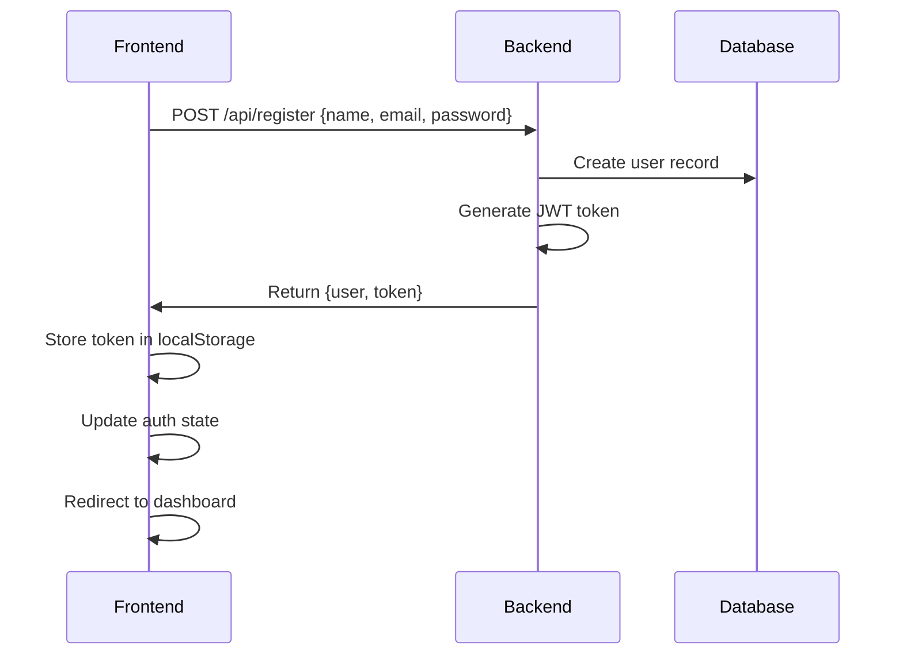
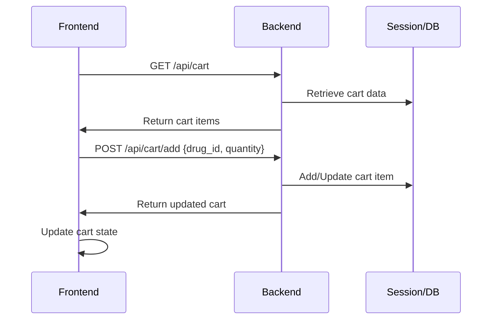
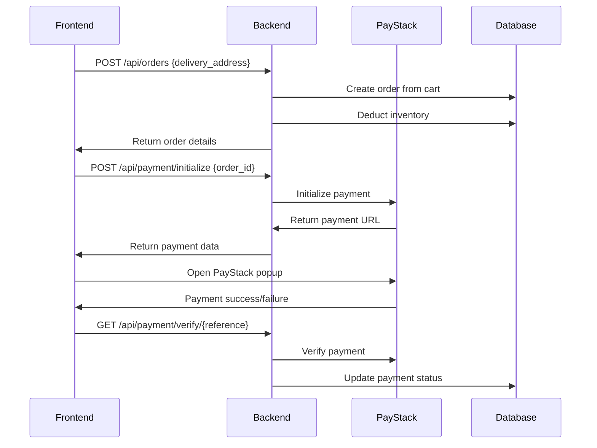
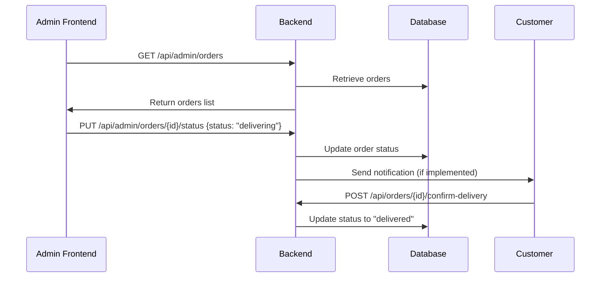

# Frontend-Backend Integration Plan

## Health Nexus E-Pharmacy System

### Table of Contents

1. [Overview](#overview)
2. [Backend API Analysis](#backend-api-analysis)
3. [Frontend Requirements Analysis](#frontend-requirements-analysis)
4. [Integration Phase Plan](#integration-phase-plan)
5. [Authentication & Authorization](#authentication--authorization)
6. [API Endpoints Mapping](#api-endpoints-mapping)
7. [Data Flow Specifications](#data-flow-specifications)
8. [State Management Strategy](#state-management-strategy)
9. [Error Handling Strategy](#error-handling-strategy)
10. [Testing Strategy](#testing-strategy)
11. [Performance Optimization](#performance-optimization)
12. [Security Considerations](#security-considerations)
13. [Implementation Timeline](#implementation-timeline)

---

## Overview

This document provides a comprehensive integration plan for connecting the Health Nexus E-Pharmacy frontend with the Laravel backend. The integration follows a modular approach with clear separation of concerns and robust error handling.

### System Architecture

```
Frontend (React/Vue/Angular) ← HTTP/REST → Backend (Laravel API) ← → Database (SQLite/MySQL)
                                              ↓
                                         PayStack Gateway
```

### Key Integration Goals

-   ✅ Seamless user authentication and session management
-   ✅ Real-time cart synchronization between guest and authenticated users
-   ✅ Secure payment processing with PayStack integration
-   ✅ Comprehensive order management with 3-state tracking
-   ✅ Admin dashboard with inventory and analytics
-   ✅ Mobile-responsive design with offline capability

---

## Backend API Analysis

### Current Backend Implementation Status

#### ✅ Implemented Features

1. **Drug Management** - Full CRUD with e-commerce fields
2. **Cart System** - Session-based for guests, database for authenticated users
3. **Order Management** - 3-state tracking (placed → delivering → delivered)
4. **Payment Integration** - PayStack with webhook verification
5. **Admin Dashboard** - Inventory management and analytics
6. **Authentication** - Laravel Sanctum with role-based access

#### 🚨 Missing Backend Components

Based on the frontend requirements, the following backend endpoints are missing:

##### 1. Payment Routes (Critical)

```php
// Missing payment routes - MUST BE IMPLEMENTED
Route::prefix('payment')->group(function () {
    Route::post('/initialize', [PaymentController::class, 'initialize']);
    Route::get('/verify/{reference}', [PaymentController::class, 'verify']);
    Route::post('/webhook', [PaymentController::class, 'webhook']);
});
```

##### 2. User Profile Management

```php
// Missing user profile routes
Route::middleware(['auth:sanctum'])->group(function () {
    Route::get('/profile', [UserController::class, 'profile']);
    Route::put('/profile', [UserController::class, 'updateProfile']);
    Route::post('/profile/avatar', [UserController::class, 'uploadAvatar']);
});
```

##### 3. Address Management

```php
// Missing address management
Route::middleware(['auth:sanctum'])->prefix('addresses')->group(function () {
    Route::get('/', [AddressController::class, 'index']);
    Route::post('/', [AddressController::class, 'store']);
    Route::put('/{address}', [AddressController::class, 'update']);
    Route::delete('/{address}', [AddressController::class, 'destroy']);
});
```

### Backend API Endpoints Summary

#### Public Endpoints (No Authentication Required)

```
GET    /api/drugs                          - Browse drugs with filtering
GET    /api/drugs/search                   - Search drugs
GET    /api/drugs/categories               - List categories
GET    /api/drugs/category/{slug}          - Drugs by category
GET    /api/drugs/{slug}                   - Drug details
GET    /api/cart                          - View cart (session-based)
POST   /api/cart/add                      - Add to cart
PUT    /api/cart/item/{id}                - Update cart item
DELETE /api/cart/item/{id}                - Remove cart item
DELETE /api/cart/clear                    - Clear cart
POST   /api/register                      - User registration
POST   /api/login                         - User login
```

#### Authenticated Endpoints (Bearer Token Required)

```
POST   /api/logout                        - User logout
GET    /api/user                          - Get current user
GET    /api/orders                        - Order history
POST   /api/orders                        - Create order
GET    /api/orders/{id}                   - Order details
POST   /api/orders/{id}/confirm-delivery  - Confirm delivery
```

#### Admin Endpoints (Admin Role Required)

```
GET    /api/admin/inventory               - Inventory overview
GET    /api/admin/inventory/statistics    - Inventory stats
PUT    /api/admin/inventory/{drug}/stock  - Update stock
GET    /api/admin/orders                  - Admin order management
PUT    /api/admin/orders/{id}/status      - Update order status
```

---

## Frontend Requirements Analysis

### Required Frontend Components

#### 1. Authentication System

-   **Login/Register Forms** with validation
-   **Password Reset** functionality
-   **JWT Token Management** with refresh
-   **Role-based Route Protection**

#### 2. Product Catalog

-   **Drug Listing** with pagination and filtering
-   **Search Functionality** with autocomplete
-   **Category Navigation** with breadcrumbs
-   **Product Detail Pages** with image gallery

#### 3. Shopping Cart

-   **Cart Icon** with item count badge
-   **Cart Drawer/Modal** for quick access
-   **Cart Page** with full management
-   **Guest Cart Synchronization** on login

#### 4. Order Management

-   **Checkout Process** with form validation
-   **Payment Integration** with PayStack
-   **Order History** with status tracking
-   **Order Details** with delivery confirmation

#### 5. Admin Dashboard

-   **Inventory Management** with bulk operations
-   **Order Processing** with status updates
-   **Analytics Dashboard** with charts
-   **User Management** capabilities

---

## Integration Phase Plan

### Phase 1: Foundation Setup (Week 1)

#### 1.1 Backend Fixes (Priority: Critical)

```bash
# Tasks to complete before frontend integration
1. Create PaymentController with required methods
2. Add missing payment routes to api.php
3. Implement user profile management
4. Add address management system
5. Set up proper CORS configuration
```

#### 1.2 Frontend Environment Setup

```bash
# Frontend configuration
1. Set up API client (Axios/Fetch)
2. Configure environment variables
3. Set up state management (Redux/Vuex/Pinia)
4. Install required dependencies
5. Set up routing with authentication guards
```

#### 1.3 API Client Configuration

```javascript
// api/client.js
import axios from "axios";

const apiClient = axios.create({
    baseURL: process.env.REACT_APP_API_URL || "http://localhost:8000/api",
    timeout: 30000,
    headers: {
        "Content-Type": "application/json",
        Accept: "application/json",
    },
});

// Request interceptor for auth token
apiClient.interceptors.request.use(
    (config) => {
        const token = localStorage.getItem("authToken");
        if (token) {
            config.headers.Authorization = `Bearer ${token}`;
        }
        return config;
    },
    (error) => Promise.reject(error)
);

// Response interceptor for error handling
apiClient.interceptors.response.use(
    (response) => response,
    (error) => {
        if (error.response?.status === 401) {
            // Handle unauthorized access
            localStorage.removeItem("authToken");
            window.location.href = "/login";
        }
        return Promise.reject(error);
    }
);

export default apiClient;
```

### Phase 2: Authentication Integration (Week 2)

#### 2.1 Authentication Service

```javascript
// services/authService.js
import apiClient from "../api/client";

class AuthService {
    async login(credentials) {
        try {
            const response = await apiClient.post("/login", credentials);
            const { token, user } = response.data.data;

            localStorage.setItem("authToken", token);
            localStorage.setItem("user", JSON.stringify(user));

            return { token, user };
        } catch (error) {
            throw this.handleError(error);
        }
    }

    async register(userData) {
        try {
            const response = await apiClient.post("/register", userData);
            const { token, user } = response.data.data;

            localStorage.setItem("authToken", token);
            localStorage.setItem("user", JSON.stringify(user));

            return { token, user };
        } catch (error) {
            throw this.handleError(error);
        }
    }

    async logout() {
        try {
            await apiClient.post("/logout");
        } catch (error) {
            console.error("Logout error:", error);
        } finally {
            localStorage.removeItem("authToken");
            localStorage.removeItem("user");
        }
    }

    getCurrentUser() {
        const userStr = localStorage.getItem("user");
        return userStr ? JSON.parse(userStr) : null;
    }

    getToken() {
        return localStorage.getItem("authToken");
    }

    isAuthenticated() {
        return !!this.getToken();
    }

    handleError(error) {
        const message = error.response?.data?.message || "An error occurred";
        const errors = error.response?.data?.errors || {};
        return { message, errors };
    }
}

export default new AuthService();
```

#### 2.2 Authentication Store (Redux/Vuex Example)

```javascript
// store/authSlice.js (Redux Toolkit)
import { createSlice, createAsyncThunk } from "@reduxjs/toolkit";
import authService from "../services/authService";

// Async thunks
export const loginUser = createAsyncThunk(
    "auth/login",
    async (credentials, { rejectWithValue }) => {
        try {
            return await authService.login(credentials);
        } catch (error) {
            return rejectWithValue(error);
        }
    }
);

export const registerUser = createAsyncThunk(
    "auth/register",
    async (userData, { rejectWithValue }) => {
        try {
            return await authService.register(userData);
        } catch (error) {
            return rejectWithValue(error);
        }
    }
);

const authSlice = createSlice({
    name: "auth",
    initialState: {
        user: authService.getCurrentUser(),
        token: authService.getToken(),
        isLoading: false,
        error: null,
    },
    reducers: {
        logout: (state) => {
            authService.logout();
            state.user = null;
            state.token = null;
            state.error = null;
        },
        clearError: (state) => {
            state.error = null;
        },
    },
    extraReducers: (builder) => {
        builder
            .addCase(loginUser.pending, (state) => {
                state.isLoading = true;
                state.error = null;
            })
            .addCase(loginUser.fulfilled, (state, action) => {
                state.isLoading = false;
                state.user = action.payload.user;
                state.token = action.payload.token;
            })
            .addCase(loginUser.rejected, (state, action) => {
                state.isLoading = false;
                state.error = action.payload;
            });
    },
});

export const { logout, clearError } = authSlice.actions;
export default authSlice.reducer;
```

### Phase 3: Product Catalog Integration (Week 3)

#### 3.1 Drug Service

```javascript
// services/drugService.js
import apiClient from "../api/client";

class DrugService {
    async getDrugs(params = {}) {
        try {
            const response = await apiClient.get("/drugs", { params });
            return response.data;
        } catch (error) {
            throw this.handleError(error);
        }
    }

    async searchDrugs(query, params = {}) {
        try {
            const response = await apiClient.get("/drugs/search", {
                params: { query, ...params },
            });
            return response.data;
        } catch (error) {
            throw this.handleError(error);
        }
    }

    async getDrugBySlug(slug) {
        try {
            const response = await apiClient.get(`/drugs/${slug}`);
            return response.data;
        } catch (error) {
            throw this.handleError(error);
        }
    }

    async getCategories() {
        try {
            const response = await apiClient.get("/drugs/categories");
            return response.data;
        } catch (error) {
            throw this.handleError(error);
        }
    }

    async getDrugsByCategory(categorySlug, params = {}) {
        try {
            const response = await apiClient.get(
                `/drugs/category/${categorySlug}`,
                {
                    params,
                }
            );
            return response.data;
        } catch (error) {
            throw this.handleError(error);
        }
    }

    handleError(error) {
        const message = error.response?.data?.message || "An error occurred";
        return new Error(message);
    }
}

export default new DrugService();
```

#### 3.2 Product Listing Component

```jsx
// components/DrugListing.jsx
import React, { useState, useEffect } from "react";
import { useSearchParams } from "react-router-dom";
import drugService from "../services/drugService";
import DrugCard from "./DrugCard";
import Pagination from "./Pagination";
import FilterSidebar from "./FilterSidebar";

const DrugListing = () => {
    const [drugs, setDrugs] = useState([]);
    const [loading, setLoading] = useState(true);
    const [error, setError] = useState(null);
    const [pagination, setPagination] = useState({});
    const [searchParams, setSearchParams] = useSearchParams();

    const filters = {
        search: searchParams.get("search") || "",
        category: searchParams.get("category") || "",
        min_price: searchParams.get("min_price") || "",
        max_price: searchParams.get("max_price") || "",
        sort_by: searchParams.get("sort_by") || "name",
        sort_direction: searchParams.get("sort_direction") || "asc",
        page: searchParams.get("page") || 1,
    };

    useEffect(() => {
        fetchDrugs();
    }, [searchParams]);

    const fetchDrugs = async () => {
        try {
            setLoading(true);
            const response = await drugService.getDrugs(filters);
            setDrugs(response.data.data);
            setPagination(response.data.meta);
        } catch (err) {
            setError(err.message);
        } finally {
            setLoading(false);
        }
    };

    const updateFilters = (newFilters) => {
        const params = new URLSearchParams(searchParams);
        Object.entries(newFilters).forEach(([key, value]) => {
            if (value) {
                params.set(key, value);
            } else {
                params.delete(key);
            }
        });
        setSearchParams(params);
    };

    if (loading) return <div className="loading">Loading drugs...</div>;
    if (error) return <div className="error">Error: {error}</div>;

    return (
        <div className="drug-listing">
            <div className="filters">
                <FilterSidebar
                    filters={filters}
                    onFiltersChange={updateFilters}
                />
            </div>

            <div className="drugs-grid">
                {drugs.map((drug) => (
                    <DrugCard key={drug.id} drug={drug} />
                ))}
            </div>

            <Pagination
                pagination={pagination}
                onPageChange={(page) => updateFilters({ page })}
            />
        </div>
    );
};

export default DrugListing;
```

### Phase 4: Shopping Cart Integration (Week 4)

#### 4.1 Cart Service

```javascript
// services/cartService.js
import apiClient from "../api/client";

class CartService {
    async getCart() {
        try {
            const response = await apiClient.get("/cart");
            return response.data.data;
        } catch (error) {
            throw this.handleError(error);
        }
    }

    async addToCart(drugId, quantity) {
        try {
            const response = await apiClient.post("/cart/add", {
                drug_id: drugId,
                quantity,
            });
            return response.data;
        } catch (error) {
            throw this.handleError(error);
        }
    }

    async updateCartItem(itemId, quantity) {
        try {
            const response = await apiClient.put(`/cart/item/${itemId}`, {
                quantity,
            });
            return response.data;
        } catch (error) {
            throw this.handleError(error);
        }
    }

    async removeCartItem(itemId) {
        try {
            const response = await apiClient.delete(`/cart/item/${itemId}`);
            return response.data;
        } catch (error) {
            throw this.handleError(error);
        }
    }

    async clearCart() {
        try {
            const response = await apiClient.delete("/cart/clear");
            return response.data;
        } catch (error) {
            throw this.handleError(error);
        }
    }

    async getCartTotals() {
        try {
            const response = await apiClient.get("/cart/totals");
            return response.data.data;
        } catch (error) {
            throw this.handleError(error);
        }
    }

    async validateCart() {
        try {
            const response = await apiClient.get("/cart/validate");
            return response.data;
        } catch (error) {
            throw this.handleError(error);
        }
    }

    handleError(error) {
        const message =
            error.response?.data?.message || "Cart operation failed";
        return new Error(message);
    }
}

export default new CartService();
```

#### 4.2 Cart Store Integration

```javascript
// store/cartSlice.js
import { createSlice, createAsyncThunk } from "@reduxjs/toolkit";
import cartService from "../services/cartService";

// Async thunks
export const fetchCart = createAsyncThunk(
    "cart/fetchCart",
    async (_, { rejectWithValue }) => {
        try {
            return await cartService.getCart();
        } catch (error) {
            return rejectWithValue(error.message);
        }
    }
);

export const addToCart = createAsyncThunk(
    "cart/addToCart",
    async ({ drugId, quantity }, { rejectWithValue }) => {
        try {
            await cartService.addToCart(drugId, quantity);
            return await cartService.getCart();
        } catch (error) {
            return rejectWithValue(error.message);
        }
    }
);

const cartSlice = createSlice({
    name: "cart",
    initialState: {
        items: [],
        totals: {
            subtotal: 0,
            tax: 0,
            total: 0,
            items_count: 0,
        },
        isLoading: false,
        error: null,
    },
    reducers: {
        clearError: (state) => {
            state.error = null;
        },
    },
    extraReducers: (builder) => {
        builder
            .addCase(fetchCart.fulfilled, (state, action) => {
                state.items = action.payload.items;
                state.totals = action.payload.totals;
                state.isLoading = false;
            })
            .addCase(addToCart.fulfilled, (state, action) => {
                state.items = action.payload.items;
                state.totals = action.payload.totals;
                state.isLoading = false;
            });
    },
});

export default cartSlice.reducer;
```

### Phase 5: Payment Integration (Week 5)

#### 5.1 Backend Payment Controller Implementation (REQUIRED)

```php
<?php
// app/Http/Controllers/PaymentController.php

namespace App\Http\Controllers;

use App\Http\Services\PaymentService;
use App\Models\Order;
use App\Models\Payment;
use Illuminate\Http\Request;
use Illuminate\Http\JsonResponse;

class PaymentController extends Controller
{
    protected PaymentService $paymentService;

    public function __construct(PaymentService $paymentService)
    {
        $this->paymentService = $paymentService;
    }

    /**
     * Initialize payment
     */
    public function initialize(Request $request): JsonResponse
    {
        $request->validate([
            'order_id' => 'required|exists:orders,id',
        ]);

        try {
            $order = Order::findOrFail($request->order_id);

            // Ensure user owns the order
            if ($order->user_id !== auth()->id()) {
                return response()->json([
                    'status' => 'error',
                    'message' => 'Unauthorized access to order'
                ], 403);
            }

            $paymentData = $this->paymentService->initializePayment($order);

            return response()->json([
                'status' => 'success',
                'message' => 'Payment initialized successfully',
                'data' => $paymentData
            ], 200);

        } catch (\Exception $e) {
            return response()->json([
                'status' => 'error',
                'message' => 'Failed to initialize payment',
                'error' => $e->getMessage()
            ], 500);
        }
    }

    /**
     * Verify payment
     */
    public function verify(string $reference): JsonResponse
    {
        try {
            $verification = $this->paymentService->verifyPayment($reference);

            return response()->json([
                'status' => 'success',
                'message' => 'Payment verification completed',
                'data' => $verification
            ], 200);

        } catch (\Exception $e) {
            return response()->json([
                'status' => 'error',
                'message' => 'Payment verification failed',
                'error' => $e->getMessage()
            ], 400);
        }
    }

    /**
     * Handle PayStack webhook
     */
    public function webhook(Request $request): JsonResponse
    {
        try {
            $this->paymentService->handleWebhook($request);

            return response()->json([
                'status' => 'success',
                'message' => 'Webhook processed successfully'
            ], 200);

        } catch (\Exception $e) {
            return response()->json([
                'status' => 'error',
                'message' => 'Webhook processing failed',
                'error' => $e->getMessage()
            ], 400);
        }
    }
}
```

#### 5.2 Frontend Payment Service

```javascript
// services/paymentService.js
import apiClient from "../api/client";

class PaymentService {
    async initializePayment(orderId) {
        try {
            const response = await apiClient.post("/payment/initialize", {
                order_id: orderId,
            });
            return response.data.data;
        } catch (error) {
            throw this.handleError(error);
        }
    }

    async verifyPayment(reference) {
        try {
            const response = await apiClient.get(
                `/payment/verify/${reference}`
            );
            return response.data.data;
        } catch (error) {
            throw this.handleError(error);
        }
    }

    // PayStack popup integration
    async processPayment(paymentData) {
        return new Promise((resolve, reject) => {
            const handler = PaystackPop.setup({
                key: process.env.REACT_APP_PAYSTACK_PUBLIC_KEY,
                email: paymentData.email,
                amount: paymentData.amount,
                currency: paymentData.currency,
                ref: paymentData.reference,
                metadata: paymentData.metadata,
                callback: (response) => {
                    resolve(response);
                },
                onClose: () => {
                    reject(new Error("Payment cancelled by user"));
                },
            });
            handler.openIframe();
        });
    }

    handleError(error) {
        const message =
            error.response?.data?.message || "Payment operation failed";
        return new Error(message);
    }
}

export default new PaymentService();
```

### Phase 6: Order Management Integration (Week 6)

#### 6.1 Order Service

```javascript
// services/orderService.js
import apiClient from "../api/client";

class OrderService {
    async getOrders(params = {}) {
        try {
            const response = await apiClient.get("/orders", { params });
            return response.data;
        } catch (error) {
            throw this.handleError(error);
        }
    }

    async createOrder(orderData) {
        try {
            const response = await apiClient.post("/orders", orderData);
            return response.data.data;
        } catch (error) {
            throw this.handleError(error);
        }
    }

    async getOrder(orderId) {
        try {
            const response = await apiClient.get(`/orders/${orderId}`);
            return response.data.data;
        } catch (error) {
            throw this.handleError(error);
        }
    }

    async confirmDelivery(orderId) {
        try {
            const response = await apiClient.post(
                `/orders/${orderId}/confirm-delivery`
            );
            return response.data;
        } catch (error) {
            throw this.handleError(error);
        }
    }

    async getOrderStatistics() {
        try {
            const response = await apiClient.get("/orders/statistics");
            return response.data.data;
        } catch (error) {
            throw this.handleError(error);
        }
    }

    handleError(error) {
        const message =
            error.response?.data?.message || "Order operation failed";
        return new Error(message);
    }
}

export default new OrderService();
```

---

## Authentication & Authorization

### Token Management Strategy

#### 1. JWT Token Storage

```javascript
// utils/tokenManager.js
class TokenManager {
    static setToken(token) {
        localStorage.setItem("authToken", token);
    }

    static getToken() {
        return localStorage.getItem("authToken");
    }

    static removeToken() {
        localStorage.removeItem("authToken");
    }

    static isTokenExpired(token) {
        if (!token) return true;

        try {
            const payload = JSON.parse(atob(token.split(".")[1]));
            return payload.exp * 1000 < Date.now();
        } catch {
            return true;
        }
    }

    static shouldRefreshToken(token) {
        if (!token) return false;

        try {
            const payload = JSON.parse(atob(token.split(".")[1]));
            const timeUntilExpiry = payload.exp * 1000 - Date.now();
            return timeUntilExpiry < 15 * 60 * 1000; // Refresh if less than 15 minutes
        } catch {
            return false;
        }
    }
}

export default TokenManager;
```

#### 2. Protected Route Component

```jsx
// components/ProtectedRoute.jsx
import React from "react";
import { Navigate, useLocation } from "react-router-dom";
import { useSelector } from "react-redux";

const ProtectedRoute = ({ children, adminOnly = false }) => {
    const { user, token } = useSelector((state) => state.auth);
    const location = useLocation();

    if (!token) {
        return <Navigate to="/login" state={{ from: location }} replace />;
    }

    if (adminOnly && user?.role?.slug !== "admin") {
        return <Navigate to="/unauthorized" replace />;
    }

    return children;
};

export default ProtectedRoute;
```

---

## API Endpoints Mapping

### Complete Frontend-Backend Mapping

#### Public Endpoints

| Frontend Action  | Backend Endpoint        | Method | Parameters                                                        |
| ---------------- | ----------------------- | ------ | ----------------------------------------------------------------- |
| Load Products    | `/api/drugs`            | GET    | `page`, `search`, `category`, `min_price`, `max_price`, `sort_by` |
| Search Products  | `/api/drugs/search`     | GET    | `query`, `page`, `limit`                                          |
| Get Categories   | `/api/drugs/categories` | GET    | -                                                                 |
| Product Details  | `/api/drugs/{slug}`     | GET    | `slug`                                                            |
| View Cart        | `/api/cart`             | GET    | -                                                                 |
| Add to Cart      | `/api/cart/add`         | POST   | `drug_id`, `quantity`                                             |
| Update Cart      | `/api/cart/item/{id}`   | PUT    | `quantity`                                                        |
| Remove from Cart | `/api/cart/item/{id}`   | DELETE | -                                                                 |

#### Authenticated Endpoints

| Frontend Action  | Backend Endpoint                    | Method | Parameters                                           |
| ---------------- | ----------------------------------- | ------ | ---------------------------------------------------- |
| User Login       | `/api/login`                        | POST   | `email`, `password`                                  |
| User Register    | `/api/register`                     | POST   | `name`, `email`, `password`, `password_confirmation` |
| User Logout      | `/api/logout`                       | POST   | -                                                    |
| Get User Profile | `/api/user`                         | GET    | -                                                    |
| Create Order     | `/api/orders`                       | POST   | `delivery_address`, `phone`, `notes`                 |
| Order History    | `/api/orders`                       | GET    | `page`, `status`                                     |
| Order Details    | `/api/orders/{id}`                  | GET    | `id`                                                 |
| Confirm Delivery | `/api/orders/{id}/confirm-delivery` | POST   | `id`                                                 |

#### Payment Endpoints (TO BE IMPLEMENTED)

| Frontend Action    | Backend Endpoint                  | Method | Parameters            |
| ------------------ | --------------------------------- | ------ | --------------------- |
| Initialize Payment | `/api/payment/initialize`         | POST   | `order_id`            |
| Verify Payment     | `/api/payment/verify/{reference}` | GET    | `reference`           |
| Payment Webhook    | `/api/payment/webhook`            | POST   | PayStack webhook data |

#### Admin Endpoints

| Frontend Action     | Backend Endpoint                    | Method | Parameters                        |
| ------------------- | ----------------------------------- | ------ | --------------------------------- |
| Inventory Overview  | `/api/admin/inventory`              | GET    | `status`, `search`, `category`    |
| Inventory Stats     | `/api/admin/inventory/statistics`   | GET    | -                                 |
| Update Stock        | `/api/admin/inventory/{drug}/stock` | PUT    | `quantity`, `operation`, `reason` |
| Admin Orders        | `/api/admin/orders`                 | GET    | `status`, `page`                  |
| Update Order Status | `/api/admin/orders/{id}/status`     | PUT    | `status`                          |

---

## Data Flow Specifications

### 1. User Registration/Login Flow



### 2. Shopping Cart Flow



### 3. Order Creation Flow



### 4. Admin Order Management Flow



---

## State Management Strategy

### Redux Store Structure

```javascript
// store/index.js
import { configureStore } from "@reduxjs/toolkit";
import authReducer from "./authSlice";
import cartReducer from "./cartSlice";
import drugReducer from "./drugSlice";
import orderReducer from "./orderSlice";
import adminReducer from "./adminSlice";

export const store = configureStore({
    reducer: {
        auth: authReducer,
        cart: cartReducer,
        drugs: drugReducer,
        orders: orderReducer,
        admin: adminReducer,
    },
    middleware: (getDefaultMiddleware) =>
        getDefaultMiddleware({
            serializableCheck: {
                ignoredActions: ["persist/PERSIST"],
            },
        }),
});
```

### State Persistence Strategy

```javascript
// store/persistConfig.js
import { persistStore, persistReducer } from "redux-persist";
import storage from "redux-persist/lib/storage";

const persistConfig = {
    key: "root",
    storage,
    whitelist: ["auth", "cart"], // Only persist auth and cart
    blacklist: ["drugs", "orders", "admin"], // Don't persist these (fetch on demand)
};

export const persistedReducer = persistReducer(persistConfig, rootReducer);
export const persistor = persistStore(store);
```

---

## Error Handling Strategy

### 1. Global Error Handler

```javascript
// utils/errorHandler.js
class ErrorHandler {
    static handle(error, context = "Application") {
        console.error(`[${context}] Error:`, error);

        // Extract meaningful error message
        let message = "An unexpected error occurred";
        let errors = {};

        if (error.response) {
            // HTTP error response
            const { data, status } = error.response;

            if (data?.message) {
                message = data.message;
            }

            if (data?.errors) {
                errors = data.errors;
            }

            // Handle specific status codes
            switch (status) {
                case 401:
                    this.handleUnauthorized();
                    break;
                case 403:
                    message = "You are not authorized to perform this action";
                    break;
                case 422:
                    message = "Please check your input and try again";
                    break;
                case 500:
                    message = "Server error. Please try again later";
                    break;
            }
        } else if (error.request) {
            // Network error
            message = "Network error. Please check your connection";
        }

        return { message, errors };
    }

    static handleUnauthorized() {
        localStorage.removeItem("authToken");
        localStorage.removeItem("user");
        window.location.href = "/login";
    }

    static showNotification(message, type = "error") {
        // Integrate with your notification system
        // e.g., toast, modal, or state update
        console.log(`[${type.toUpperCase()}] ${message}`);
    }
}

export default ErrorHandler;
```

### 2. Error Boundary Component

```jsx
// components/ErrorBoundary.jsx
import React from "react";

class ErrorBoundary extends React.Component {
    constructor(props) {
        super(props);
        this.state = { hasError: false, error: null, errorInfo: null };
    }

    static getDerivedStateFromError(error) {
        return { hasError: true };
    }

    componentDidCatch(error, errorInfo) {
        this.setState({
            error: error,
            errorInfo: errorInfo,
        });
    }

    render() {
        if (this.state.hasError) {
            return (
                <div className="error-boundary">
                    <h2>Something went wrong.</h2>
                    <details style={{ whiteSpace: "pre-wrap" }}>
                        {this.state.error && this.state.error.toString()}
                        <br />
                        {this.state.errorInfo.componentStack}
                    </details>
                    <button onClick={() => window.location.reload()}>
                        Reload Page
                    </button>
                </div>
            );
        }

        return this.props.children;
    }
}

export default ErrorBoundary;
```

---

## Testing Strategy

### 1. Backend API Testing

```php
// tests/Feature/DrugControllerTest.php
<?php

namespace Tests\Feature;

use App\Models\Drug;
use App\Models\User;
use Illuminate\Foundation\Testing\RefreshDatabase;
use Tests\TestCase;

class DrugControllerTest extends TestCase
{
    use RefreshDatabase;

    public function test_can_fetch_drugs_list()
    {
        Drug::factory()->count(5)->create();

        $response = $this->get('/api/drugs');

        $response->assertStatus(200)
                ->assertJsonStructure([
                    'data' => [
                        'data' => [
                            '*' => ['id', 'name', 'slug', 'price', 'stock']
                        ]
                    ]
                ]);
    }

    public function test_can_search_drugs()
    {
        Drug::factory()->create(['name' => 'Paracetamol']);
        Drug::factory()->create(['name' => 'Aspirin']);

        $response = $this->get('/api/drugs/search?query=Paracetamol');

        $response->assertStatus(200)
                ->assertJsonCount(1, 'data.data');
    }

    public function test_authenticated_user_can_add_to_cart()
    {
        $user = User::factory()->create();
        $drug = Drug::factory()->create();

        $response = $this->actingAs($user, 'sanctum')
                         ->post('/api/cart/add', [
                             'drug_id' => $drug->id,
                             'quantity' => 2
                         ]);

        $response->assertStatus(200);
    }
}
```

### 2. Frontend Unit Testing

```javascript
// __tests__/services/drugService.test.js
import { describe, it, expect, vi } from "vitest";
import drugService from "../src/services/drugService";
import apiClient from "../src/api/client";

vi.mock("../src/api/client");

describe("DrugService", () => {
    beforeEach(() => {
        vi.clearAllMocks();
    });

    it("should fetch drugs successfully", async () => {
        const mockData = {
            data: {
                data: [{ id: 1, name: "Paracetamol", price: 100 }],
            },
        };

        apiClient.get.mockResolvedValue(mockData);

        const result = await drugService.getDrugs();

        expect(apiClient.get).toHaveBeenCalledWith("/drugs", { params: {} });
        expect(result).toEqual(mockData.data);
    });

    it("should handle errors gracefully", async () => {
        const mockError = {
            response: {
                data: { message: "Server error" },
            },
        };

        apiClient.get.mockRejectedValue(mockError);

        await expect(drugService.getDrugs()).rejects.toThrow("Server error");
    });
});
```

### 3. Integration Testing

```javascript
// __tests__/integration/auth.test.js
import { describe, it, expect } from "vitest";
import { render, screen, fireEvent, waitFor } from "@testing-library/react";
import { Provider } from "react-redux";
import { store } from "../src/store";
import Login from "../src/components/Login";

describe("Authentication Integration", () => {
    it("should login user successfully", async () => {
        render(
            <Provider store={store}>
                <Login />
            </Provider>
        );

        fireEvent.change(screen.getByLabelText(/email/i), {
            target: { value: "user@example.com" },
        });

        fireEvent.change(screen.getByLabelText(/password/i), {
            target: { value: "password123" },
        });

        fireEvent.click(screen.getByRole("button", { name: /login/i }));

        await waitFor(() => {
            expect(screen.getByText(/welcome/i)).toBeInTheDocument();
        });
    });
});
```

---

## Performance Optimization

### 1. API Response Caching

```javascript
// utils/cache.js
class APICache {
    constructor() {
        this.cache = new Map();
        this.timeouts = new Map();
    }

    set(key, data, ttl = 300000) {
        // 5 minutes default
        this.cache.set(key, data);

        // Clear existing timeout
        if (this.timeouts.has(key)) {
            clearTimeout(this.timeouts.get(key));
        }

        // Set new timeout
        const timeout = setTimeout(() => {
            this.cache.delete(key);
            this.timeouts.delete(key);
        }, ttl);

        this.timeouts.set(key, timeout);
    }

    get(key) {
        return this.cache.get(key);
    }

    has(key) {
        return this.cache.has(key);
    }

    delete(key) {
        this.cache.delete(key);
        if (this.timeouts.has(key)) {
            clearTimeout(this.timeouts.get(key));
            this.timeouts.delete(key);
        }
    }

    clear() {
        this.cache.clear();
        this.timeouts.forEach((timeout) => clearTimeout(timeout));
        this.timeouts.clear();
    }
}

export default new APICache();
```

### 2. Image Optimization

```javascript
// utils/imageOptimizer.js
class ImageOptimizer {
    static generateSrcSet(baseUrl, sizes = [400, 800, 1200]) {
        return sizes.map((size) => `${baseUrl}?w=${size} ${size}w`).join(", ");
    }

    static lazyLoad() {
        const images = document.querySelectorAll("img[data-src]");

        const imageObserver = new IntersectionObserver((entries) => {
            entries.forEach((entry) => {
                if (entry.isIntersecting) {
                    const img = entry.target;
                    img.src = img.dataset.src;
                    img.classList.remove("lazy");
                    imageObserver.unobserve(img);
                }
            });
        });

        images.forEach((img) => imageObserver.observe(img));
    }
}

export default ImageOptimizer;
```

### 3. Bundle Optimization

```javascript
// webpack.config.js (if using custom webpack)
module.exports = {
    optimization: {
        splitChunks: {
            chunks: "all",
            cacheGroups: {
                vendor: {
                    test: /[\\/]node_modules[\\/]/,
                    name: "vendors",
                    chunks: "all",
                },
                common: {
                    name: "common",
                    minChunks: 2,
                    chunks: "all",
                    enforce: true,
                },
            },
        },
    },
};
```

---

## Security Considerations

### 1. XSS Prevention

```javascript
// utils/sanitizer.js
import DOMPurify from "dompurify";

class Sanitizer {
    static sanitizeHTML(dirty) {
        return DOMPurify.sanitize(dirty);
    }

    static sanitizeInput(input) {
        if (typeof input !== "string") return input;

        return input
            .replace(/[<>]/g, "") // Remove angle brackets
            .trim();
    }

    static validateEmail(email) {
        const emailRegex = /^[^\s@]+@[^\s@]+\.[^\s@]+$/;
        return emailRegex.test(email);
    }

    static validatePassword(password) {
        // At least 8 characters, 1 uppercase, 1 lowercase, 1 number
        const passwordRegex =
            /^(?=.*[a-z])(?=.*[A-Z])(?=.*\d)[a-zA-Z\d@$!%*?&]{8,}$/;
        return passwordRegex.test(password);
    }
}

export default Sanitizer;
```

### 2. CSRF Protection

```javascript
// utils/csrfProtection.js
class CSRFProtection {
    static async getToken() {
        try {
            const response = await fetch("/sanctum/csrf-cookie");
            return response.ok;
        } catch (error) {
            console.error("Failed to get CSRF token:", error);
            return false;
        }
    }

    static setTokenHeader(config) {
        const token = document
            .querySelector('meta[name="csrf-token"]')
            ?.getAttribute("content");
        if (token) {
            config.headers["X-CSRF-TOKEN"] = token;
        }
        return config;
    }
}

export default CSRFProtection;
```

### 3. Content Security Policy

```html
<!-- index.html -->
<meta
    http-equiv="Content-Security-Policy"
    content="
  default-src 'self';
  script-src 'self' 'unsafe-inline' https://js.paystack.co;
  style-src 'self' 'unsafe-inline';
  img-src 'self' data: https:;
  connect-src 'self' https://api.paystack.co;
  frame-src https://js.paystack.co;
"
/>
```

---

## Implementation Timeline

### Week 1: Foundation Setup

**Backend Tasks (Priority: Critical)**

-   [ ] Create PaymentController with all required methods
-   [ ] Add payment routes to api.php
-   [ ] Implement user profile management endpoints
-   [ ] Add address management system
-   [ ] Configure CORS for frontend domain
-   [ ] Test all existing API endpoints

**Frontend Tasks**

-   [ ] Set up project structure and routing
-   [ ] Configure API client with interceptors
-   [ ] Set up state management (Redux/Vuex)
-   [ ] Implement authentication guards
-   [ ] Create base components and layouts

**Deliverables:**

-   ✅ Functional backend API with payment endpoints
-   ✅ Frontend project structure with authentication

### Week 2: Authentication Integration

**Backend Tasks**

-   [ ] Verify Sanctum token configuration
-   [ ] Test authentication flows
-   [ ] Implement role-based middleware

**Frontend Tasks**

-   [ ] Implement login/register forms
-   [ ] Create authentication service
-   [ ] Set up token management
-   [ ] Implement protected routes
-   [ ] Create user profile components

**Deliverables:**

-   ✅ Complete authentication system
-   ✅ User registration and login flows
-   ✅ Protected route navigation

### Week 3: Product Catalog Integration

**Backend Tasks**

-   [ ] Optimize drug query performance
-   [ ] Test search and filtering
-   [ ] Verify pagination responses

**Frontend Tasks**

-   [ ] Create product listing components
-   [ ] Implement search functionality
-   [ ] Add filtering and sorting
-   [ ] Create product detail pages
-   [ ] Implement responsive design

**Deliverables:**

-   ✅ Complete product browsing experience
-   ✅ Search and filter functionality
-   ✅ Product detail pages

### Week 4: Shopping Cart Integration

**Backend Tasks**

-   [ ] Test cart persistence for guests and users
-   [ ] Verify cart synchronization on login
-   [ ] Test cart validation endpoints

**Frontend Tasks**

-   [ ] Create cart components (icon, drawer, page)
-   [ ] Implement cart state management
-   [ ] Add cart item management
-   [ ] Create checkout process UI
-   [ ] Implement cart validation

**Deliverables:**

-   ✅ Functional shopping cart system
-   ✅ Cart persistence and synchronization
-   ✅ Checkout process UI

### Week 5: Payment Integration

**Backend Tasks**

-   [ ] Complete PayStack webhook implementation
-   [ ] Test payment initialization and verification
-   [ ] Implement payment logging
-   [ ] Configure production PayStack settings

**Frontend Tasks**

-   [ ] Integrate PayStack payment popup
-   [ ] Implement payment flow UI
-   [ ] Add payment status handling
-   [ ] Create payment success/failure pages
-   [ ] Test payment scenarios

**Deliverables:**

-   ✅ Complete payment processing system
-   ✅ PayStack integration with webhook verification
-   ✅ Payment status tracking

### Week 6: Order Management Integration

**Backend Tasks**

-   [ ] Test order creation from cart
-   [ ] Verify inventory deduction
-   [ ] Test order status updates

**Frontend Tasks**

-   [ ] Create order history components
-   [ ] Implement order tracking
-   [ ] Add delivery confirmation
-   [ ] Create order detail views
-   [ ] Implement order status updates

**Deliverables:**

-   ✅ Complete order management system
-   ✅ Order tracking and status updates
-   ✅ Delivery confirmation process

### Week 7: Admin Dashboard Integration

**Backend Tasks**

-   [ ] Test admin middleware protection
-   [ ] Verify inventory management endpoints
-   [ ] Test analytics and reporting

**Frontend Tasks**

-   [ ] Create admin dashboard layout
-   [ ] Implement inventory management
-   [ ] Add order processing interface
-   [ ] Create analytics dashboards
-   [ ] Implement bulk operations

**Deliverables:**

-   ✅ Complete admin dashboard
-   ✅ Inventory management interface
-   ✅ Order processing system

### Week 8: Testing & Deployment

**Backend Tasks**

-   [ ] Complete API testing suite
-   [ ] Performance optimization
-   [ ] Security audit
-   [ ] Production deployment preparation

**Frontend Tasks**

-   [ ] Complete component testing
-   [ ] Integration testing
-   [ ] Performance optimization
-   [ ] Build production bundle
-   [ ] Deployment configuration

**Deliverables:**

-   ✅ Complete test coverage
-   ✅ Production-ready application
-   ✅ Deployment documentation

---

## Required Backend Changes Summary

### Critical Missing Components

#### 1. Payment Routes (MUST IMPLEMENT)

Add to `routes/api.php`:

```php
// Payment routes (MISSING - CRITICAL)
Route::middleware(['auth:sanctum'])->prefix('payment')->group(function () {
    Route::post('/initialize', [PaymentController::class, 'initialize']);
    Route::get('/verify/{reference}', [PaymentController::class, 'verify']);
});

// Public webhook (no auth required)
Route::post('/payment/webhook', [PaymentController::class, 'webhook']);
```

#### 2. PaymentController Class (MUST CREATE)

Create `app/Http/Controllers/PaymentController.php` with methods:

-   `initialize(Request $request)`
-   `verify(string $reference)`
-   `webhook(Request $request)`

#### 3. User Profile Routes (RECOMMENDED)

```php
Route::middleware(['auth:sanctum'])->group(function () {
    Route::get('/profile', [UserController::class, 'profile']);
    Route::put('/profile', [UserController::class, 'updateProfile']);
});
```

#### 4. CORS Configuration

Update `config/cors.php` to allow frontend domain:

```php
'allowed_origins' => [
    'http://localhost:3000', // React dev server
    'http://localhost:5173', // Vite dev server
    'https://your-frontend-domain.com', // Production
],
```

### Verification Checklist

Before starting frontend integration, verify:

-   [ ] All API endpoints return consistent JSON structure
-   [ ] Authentication middleware works correctly
-   [ ] PayStack payment endpoints are implemented
-   [ ] CORS is configured for frontend domain
-   [ ] Database migrations are up to date
-   [ ] API documentation is accessible at `/docs/api`

---

## Conclusion

This integration plan provides a comprehensive roadmap for connecting the Health Nexus E-Pharmacy frontend with the Laravel backend. The plan prioritizes critical missing components (especially payment endpoints) and provides detailed implementation examples for each integration phase.

**Key Success Factors:**

1. **Complete missing backend components first** (especially PaymentController)
2. **Follow the week-by-week implementation timeline**
3. **Maintain consistent error handling across all components**
4. **Implement comprehensive testing for each phase**
5. **Optimize performance for production deployment**

**Next Steps:**

1. Implement missing backend PaymentController and routes
2. Set up frontend project with the provided code examples
3. Follow the phase-by-phase integration plan
4. Test each component thoroughly before moving to the next phase
5. Deploy to staging environment for end-to-end testing

This plan ensures a robust, secure, and scalable e-pharmacy system with seamless frontend-backend integration.
